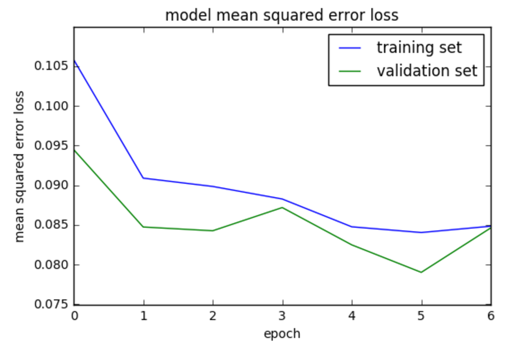
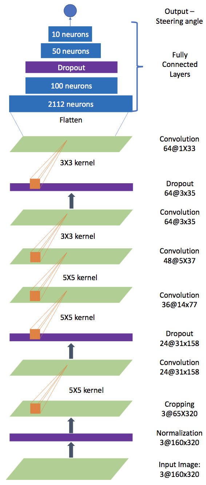
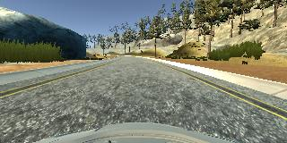
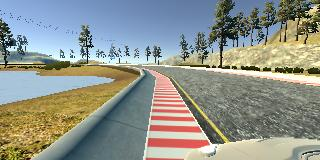

Behavioural Cloning: Sumedha Swamy (sumedhaswamy@gmail.com)
============================================================

The goals / steps of this project are the following:

-   Use the simulator to collect data of good driving behavior

-   Build, a convolution neural network in Keras that predicts steering
    angles from images

-   Train and validate the model with a training and validation set

-   Test that the model successfully drives around track one without
    leaving the road

-   Summarize the results with a written report


[//]: # (Image References)

[MSE_Image]: ./media/MSE.png "Mean Squared Error Loss"
[Left_Recovery_Image]: ./media/left_recovery.jpg "Recovery from left side of road"
[Center_Driving_Image]: ./media/center_driving.jpg "Center Driving"
[Architecture_Image]: ./media/arch.png "Model Architecture"


Files Submitted & Code Quality
==============================

1.  Submission includes all required files and can be used to run the
    simulator in autonomous mode.

    -   My project includes the following files:

        -   model.py containing the script to create and train the model

        -   drive.py for driving the car in autonomous mode

        -   model.h5 containing a trained convolution neural network

        -   writeup\_report.pdf summarizing the results

2.  Submission includes functional code

    -   Using the Udacity provided simulator and my drive.py file, the
        car can be driven autonomously around the track by executing
        ``` python
		python drive.py model.h5
		```

3.  Submission code is usable and readable

    -   The model.py file contains the code for training and saving the
        convolution neural network. The file shows the pipeline I used
        for training and validating the model, and it contains comments
        to explain how the code works.

Model Architecture and Training Strategy
========================================

1.  An appropriate model architecture has been employed

    -   My model consists of a deep neural network with convolution
        layers of filter sized 3x3 and 5x5 (code lines 74-80). The model
        accepts a 3-channel image of dimensions 160x320 pixels as the
        input. The convolution layers process the image to with filters
        of depth 24, 36,48 and 64. Finally 5 layers of fully connected
        layers process the output of the convolutional layers to
        generate the output steering angle.

    -   The model includes RELU layers to introduce nonlinearity (code
        lines 74-80), and the data is normalized in the model using a
        Keras lambda layer (code line 67).

2.  Attempts to reduce overfitting in the model

    -   The model contains dropout layers in order to reduce overfitting
        (model.py lines 75, 79, 85).

    -   The model was trained and validated on different data sets to
        ensure that the model was not overfitting (code line 20, 93,
        94). The model was tested by running it through the simulator
        and ensuring that the vehicle could stay on the track.

3.  Model parameter tuning

    -   The model used an adam optimizer, so the learning rate was not
        tuned manually (model.py line 90).

4.  Appropriate training data

    -   I used the following training data:

        i.  Center lane driving – a few laps

        ii. Center lane driving in the opposite direction – a couple of laps

        iii. Recovering from the left and right sides of the road in different situations:

            1.  Normal Road

            2.  With emergency markers on the road

            3.  In road without any lane markings

        iv. I used both the available tracks to generate training data, although there was more training data from the first track.

    -   For details about how I created the training data, see the next section.

Model Architecture and Training Strategy
========================================

1.  Solution Design Approach

    -   **Overall Strategy:** The overall strategy for deriving a model
        architecture was to have the simplest model that would achieve a
        small mean squared error and ensure that the car drove
        successfully in the simulator. I wanted to ensure that the model
        was not over fit. Before starting training the model, I split
        the data such that I used 80% of the data as the training set
        and 20% of the data as the validation set.

    -   **Getting Started:** To get started, I wanted to get a feel for
        how the model would perform using well known models trained to
        identify images. I started with a convolutional neural network
        similar to the LeNet model. The model did not perform too well.
        With this model, the car drove only a small distance swaying
        wildly before driving off to the side and being unable to
        recover. The model had high amount of bias (under fit) as seen
        by the fact that both the training error and the validation
        error continued to remain high even with increasing number of
        epochs of training. It was therefore clear to me that I needed
        to

        i.  add more complexity to the model.

        ii. add more training data to help recover from the car veering off track

    -   **Adding Complexity:** I experimented with adding more
        convolutional layers and checking the performance of the model.
        I finally read the paper “[End to End Learning for Self-Driving
        Cars](https://arxiv.org/abs/1604.07316)” an implemented a model
        similar to the one described in the paper. While the model
        started to perform fairly well, a check of the mean squared
        error loss of the training and validation set told me that the
        model was overfitting the training data – as evidenced by the
        MSE for the validation set increasing after 5 epochs while the
        MSE of the training set continued to decrease. Since my model
        was overfitting, I added 3 dropout layers – two interspersed
        between convolution layers and one interspersed between fully
        connected layers. The dropouts reduced the overfitting and the
        MSE of training and validation sets were both small at 5 epochs
        as seen below:



-   At this point, the model was performing fairly well – the car in the
    simulator was mostly driving well in most of the track with the
    exception of some problematic areas such as near the bridge where
    the lane markings disappear. I added more training data to help the
    model handle those challenging areas. The model was now able to
    ensure that the vehicle drove around the driving track successfully.

1.  Final Model Architecture

    -   The final model architecture consists of:

        i.  5 Convolutional Layers

        ii. 4 Fully connected layers

        iii. 3 Dropout Layers

        iv. Lambda Layer for normalization

        v.  Cropping layer

    -   The visualization on here shows the model in detail with
        the shapes of outputs at each of the layers. 

2.  Creation of the Training Set & Training Process

    -   To capture good driving behavior, I first recorded three laps on
        track one using center lane driving. Here is an example image of
        center lane driving. 

    -   Next, recorded recovering the car from the left and right sides
        of the road back to the center. Here is an example of the
        situation. 

    -   Next, I drove the lap in the opposite direction to add to the
        training data.

    -   In all the cases above, I used the images from the center
        camera, left camera and right camera. For images from left and
        right cameras, I used a correction factor of 0.2 (code lines
        43, 46) to the steering angle.

    -   I recorded and drove especially carefully in problematic areas such as:

        i.  Curves

        ii. Areas with no lane markings

        iii. Areas with emergency markers

        iv. Areas where the car transitions from one type of road to the other

    -   I used the second track to collect additional data to help the
        model generalize better.

    -   I considered flipping the images to get additional training
        data. However, I did not do so because, even with the above
        steps, the model was able to generalize the track well enough to
        drive around the track successfully.

    -   In total, I had 140205 image data points. I randomly shuffled
        this data set and used 80% of this dataset as training data and
        20% of the data as validation set.

    -   As seen in the MSE graph above, the ideal number of epochs in
        training was 6.

    -   I used an adam optimizer (code line 90). Therefore, I did not
        have to manually train the optimizer.


